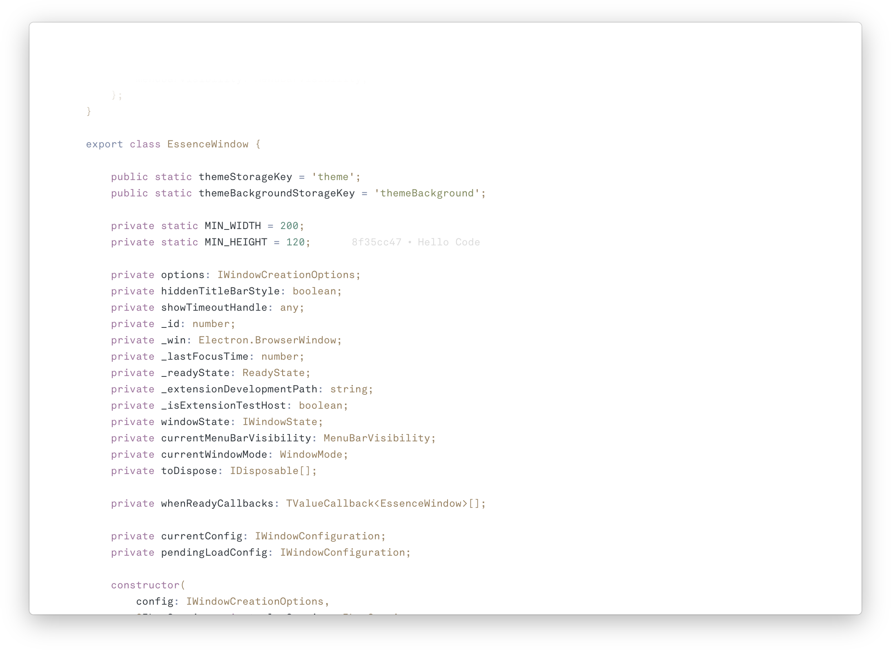

<h3 align="center">Essence with <a href="https://github.com/flagello/A.tmTheme">A</a></h3>

        

A Visual Studio Code fork, Essence features a frameless window, visual improvements (taking advantage of the new color themes), and the enhanced Zen Mode you see above. Press <code>Shift</code> + <code>Cmd</code> to drag a window.

 

[Download the latest version (1.13.1) signed binary (.app; macOS only) via GitHub releases](https://github.com/flagello/essence/releases/latest), or [build and run from source](https://github.com/Microsoft/vscode/wiki/How-to-Contribute#build-and-run-from-source).
